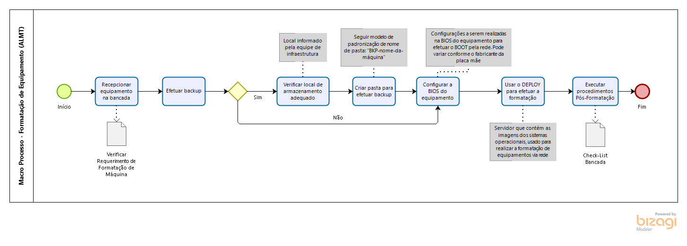

# Formatação de Computador


_Mapeamento do Processo de Formatação de Equipamento - STI / ALMT_


### Pré-requisitos:


* Avaliação prévia do equipamento realizada pelo _**Técnico N2**_;
* _**Requerimento de Formatação de Equipamento**_ preenchido corretamente pelo solicitante.


### Público Alvo:

* Técnico de Bancada

### Procedimentos:

#### 1 - Recepção do Equipamento

O equipamento é recepcionado pelo Técnico de Bancada juntamente com o _**"Requerimento de Formatação de Equipamento"**_, documento emitido através da Intranet, área da Informática, assim como exibido nas imagens abaixo:

.png>)

.png>)

#### 1.1 - Analisar Requerimento de Formatação de Equipamento

Nesse documento contém várias informações a serem analisadas, tais como: informações do setor solicitante, matrícula do servidor e informações referentes a execução de backup, assim como mostra a imagem abaixo:

.png>)

#### 2 - Backup de arquivos

Caso o usuário tenha optado pela **NÃO** realização do backup dos arquivos, pule essa etapa, caso contrário, é necessário executar os procedimentos abaixo:

* [x] Criar uma pasta no diretório de rede disponibilizado pela equipe de infraestrutura e usar o seguinte padrão de nome: _**BKP-nome-da-máquina;**_
* [x] Criar subpasta(s) dentro do diretório recém-criado e copiar os arquivos do usuário para dentro desse diretório usando o seguinte padrão de nome: _**número da Matrícula ou CPF.**_


_**Cuidado!**_

_Para cada usuário a ser realizado o backup, é necessário criar uma nova subpasta._



_Caso o equipamento não estiver ligando, será necessário remover o disco rígido e adicioná-lo em uma dock station ou adicioná-lo em outro equipamento como HD secundário, dessa maneira, será possível efetuar a cópia dos arquivos do usuário para o diretório de rede e possibilitar a posterior restauração dos arquivos_.


#### 3 - Instalar o Sistema Operacional

#### 3.1 - Configurar a BIOS do equipamento


_**Observação**_

_Quando você cria uma implantação de sistema operacional direcionada somente a computadores com BIOS x64 ou x86, ambas as imagens de inicialização devem estar disponíveis no ponto de distribuição_.


Para proceder com a instalação do Sistema Operacional, é necessário utilizar o Servidor de WDS (_Windows Deployment Services_), que possui dentro da sua estrutura, as imagens personalizadas do sistema operacional a ser instalado. Sendo assim, é necessário seguir os procedimentos abaixo:

* [x] Conectar o equipamento na rede _**DEPLOY**_ (172.17.100.xxx);
* [x] Habilitar e configurar a BIOS do computador para dar boot pela rede PXE (Pre-Boot Execution Environment) e checar os seguintes itens, sendo que as configurações podem variar conforme o fabricante da placa-mãe:
  * [x] Boot Mode: UEFI
  * [x] CSM: Disable
  * [x] Network Stack: Enable
  * [x] Sata Mode: AHCI
  * [x] Intel Virtualization: Enable
* [x] Salvar as configurações realizadas e reiniciar o computador;
* [x] Quando o equipamento der o primeiro sinal de vídeo, pressione a tecla F12 e inicie o boot através da rede. Será exibida uma imagem semelhante como segue logo abaixo:

.png>)


Caso os procedimentos acima forem executados com sucesso👍 , alguns procedimentos serão executados automaticamente pelo Servidor de WDS, assim como exibido no vídeo abaixo: 😉




#### 3.2 - Inserir informações de usuário

Para prosseguir com a instalação, será solicitado na tela seguinte, um usuário que seja membro do grupo de _**"usuários de domínio".**_ Preencha as informações de usuário e senha, assim como ilustrado na figura abaixo:

.png>)

#### 3.3 - Selecionar a imagem a ser instalada

Selecione a imagem que contenha a _**Data de Mudança**_ mais recente e que seja compatível com a arquitetura da CPU do equipamento, sendo 32bits (x86) ou 64bits (x64).

.png>)

#### 3.4 - Criando as partições

Siga os procedimentos abaixo descritos:

* [x] Apagar todas as partições existentes;
* [x] Criar uma nova partição;
* [x] Clique no botão _**"Próximo";**_
* [x] Aguardar o final da instalação.




_Aqui nesse ponto é finalizado o processo de instalação do Sistema Operacional.😉👍_


#### 3.5 - Configurações iniciais da instalação do Sistema Operacional

A partir dessa etapa, é iniciada as configurações e padronização do Sistema Operacional e para finalizar com êxito toda a instalação, será necessário seguir o _**Check-List**_ abaixo:

* [x] Definir a região como _**"Brasil"**_;
* [x] Definir o layout do teclado como _**"Português (Brasil ABNT2)"**_;
* [x] _**Pular**_ a etapa para adicionar um segundo layout de teclado;
* [x] Marcar a opção _**"Configurar para uma organização"**_;
* [x] Clique na opção de _**"Conta offline"**_;

.png>)

* [x] Clique na opção _**"Experiência limitada"**_;

.png>)

* [x] Criar o usuário _**"almt";**_

.png>)


_**Atenção!**_

_No campo senha, favor deixar em branco._ 😉


.png>)

* [x] _**Recusar e Desabilitar**_ todas as configurações da assistente _**Cortana**_; 👍




Parabéns!!! Instalação Finalizada. 😀👍👏


#### 4 - Finalizando a instalação do Sistema Operacional

Para finalizar a instalação, é necessário executar os procedimentos abaixo:

* [x] Ativar a conta do usuário _administrador local_ ([CLIQUE AQUI ](https://youtu.be/so\_HVEM2VD0)para visualizar o vídeo tutorial);
* [x] Desativar _usuário local_ criado durante a instalação;
* [x] Renomear o nome do equipamento;
* [x] Ingressar o equipamento no domínio _**al.mt.gov.br**_;
* [x] Fazer a movimentação do equipamento no Active Directory (AD) N3;
* [x] Reiniciar o equipamento e efetuar o login com o usuário que seja membro do grupo Suporte\_Admin\_\_\_Local;
* [x] Verificar a Ativação do Windows;
* [x] Verificar a Ativação do Microsoft Office;
* [x] Obter atualizações do Windows através do Servidor WSUS (Para forçar as atualizações no Windows 10, usar os seguintes comandos: #usoclient startdownload |||| #usoclient startinstall;
* [x] Instalar antivírus (\sto-002193\rsp\Programas\Anti Virus Kaspersky\\);
* [x] Verificar se os programas abaixo estão instalados e atualizados. Caso não estejam, instale a partir do repositório de rede \sto-002193\rsp\Programas
  * [x] Adobe Reader DC
  * [x] VLC
  * [x] Winrar
  * [x] PDFSam
  * [x] Java64
  * [x] K-lite Codec
  * [x] Office 2016 (Word, Excel, Power Point)
  * [x] Google Chrome
  * [x] Mozilla Firefox
  * [x] Edge
* [x] Verificar se o Agente Fusion Inventory está instalado. Caso não esteja, instale a partir do endereço de rede (\almt\SYSVOL\al.mt.gov.br\FusionAgentInstall-TopDesk\FusionAgentInstall-TopDesk.vbs) e forçar o inventário executando o seguinte arquivo no computador: (C:\ProgramFiles\FusionInventory-Agent\FusionInventory-Agent.bat)
* [x] Instalar os drivers do equipamento utilizando o DriverPack (Desmarque todos os programas sugeridos pelo software)
* [x] Verificar no GLPI se o agente está comunicando e fazer a movimentação para a unidade correta (Solicitar para o Gerente de Ativos)
* [x] Logar como administrador local e desligar a máquina.
