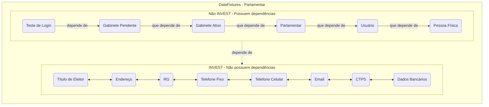

 
```mermaid

flowchart LR
  subgraph DataFixtures - Servidor e Comissionado
    direction TB
    subgraph inv[INVEST - Não possuem dependências]
        
        te(Título de Eleitor)
        ender(Endereço)
        rg(RG)
        telfixo(Telefone Fixo)
        cel(Telefone Celular)
        email(Email)
        ctps(CTPS)
        db(Dados Bancários)
        te<-->ender<-->rg<-->telfixo<-->cel<-->email<-->ctps<-->db
    end
    subgraph ni[Não INVEST - Possuem dependências]
    
        pf(Pessoa Física)
        user(Usuário)
        serv(Servidor)
        horaserv(Horário do Servidor)
        testelogin(Teste de Login)
        testelogin-- depende de -->horaserv -- que depende de -->serv -- que depende de -->user -- que depende de -->pf
    end
    ni-. depende de .->inv
  end

  ```
  
  ```mermaid

flowchart LR
  subgraph DataFixtures - Terceirizado
    direction TB
    subgraph inv[INVEST - Não possuem dependências]
        
        te(Título de Eleitor)
        ender(Endereço)
        rg(RG)
        telfixo(Telefone Fixo)
        cel(Telefone Celular)
        email(Email)
        ctps(CTPS)
        db(Dados Bancários)
        te<-->ender<-->rg<-->telfixo<-->cel<-->email<-->ctps<-->db
    end
    subgraph ni[Não INVEST - Possuem dependências]
    
        pf(Pessoa Física)
        user(Usuário)
        serv(Servidor)
        testelogin(Teste de Login)
        testelogin-- depende de -->serv -- que depende de -->user -- que depende de -->pf
    end
    ni-. depende de .->inv
  end

  ```
